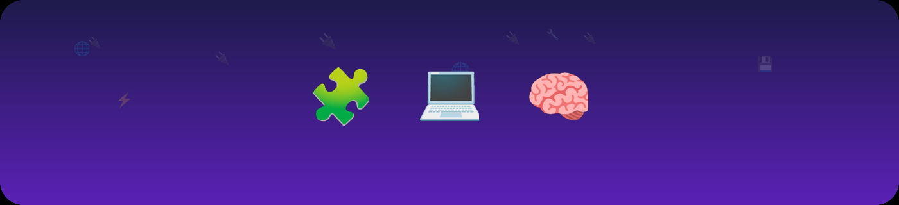

  

<h1 align="center">Abdullah Abdul Hakim</h1>

  

  
  
  
  

  <i>"A passionate Software Engineer who hates the 'Vibe-Coding' term — instead tries to use AI to build software using proven computer science techniques."</i>

---

### 🧰 Tech I work with

  
  
  
  
  
  
  

---

### 📊 GitHub stats

  
  

  

---

## 🚀 Featured Projects

### 🤖 [PAOS — Personal Agent Operating System](https://github.com/7kim/PAOS)

  

  

A multi-agent orchestration framework built around a written constitution — the **H-Factor Protocol** — that separates planning from execution from review across agents, with a Peer Review gate that blocks a step from running until it's approved. On top of that: visual DAG pipelines, an 11-agent registry (Claude Code, Codex, Gemini, Hermes, and more), cascading execution with topological (Kahn's-algorithm) ordering, and a single Next.js dashboard covering 63 API endpoints, 18 pages, token/cost tracking, and an evidence-based 110-question code benchmark.

  
  
  
  

---

### 🧩 [Claude Code Skills](https://github.com/7kim/Claude-Code-Skills)

  

A documented collection of **Claude Skills** — reusable, self-contained workflows that extend what Claude can do automatically:

| Skill | What it does |
|---|---|
| 📝 [Notes OCR](https://github.com/7kim/Claude-Code-Skills/tree/main/notes-ocr) | Handwritten scans → Markdown + Excel + PDF, with faithful Mermaid diagram reconstruction |
| 💡 [Brainstorm-to-Code](https://github.com/7kim/Claude-Code-Skills/tree/main/brainstorm-to-code) | Interactive Q&A → clean Python class skeletons |
| 🧠 [Agent_Brain](https://github.com/7kim/Claude-Code-Skills/tree/main/brain-anatomy) | A bio-inspired agent architecture (cerebral-cortex lobes → orchestration modules), with 10 UML diagrams |

  
  

---

### 📚 [Coding Wiki & Resources](https://github.com/7kim/Coding-Wiki-and-resources)

A personal **knowledge base / Obsidian vault** cataloguing the AI development stack — languages, frontend, databases, infra, AI providers, and agentic harnesses — organized as a structured reference for the full dev toolchain.

  
  

---

  Built by Abdullah Abdul Hakim · Dubai 📍 · <a href="https://twitter.com/7akim97">@7akim97</a> · <a href="https://www.linkedin.com/in/7kim/">LinkedIn</a>

